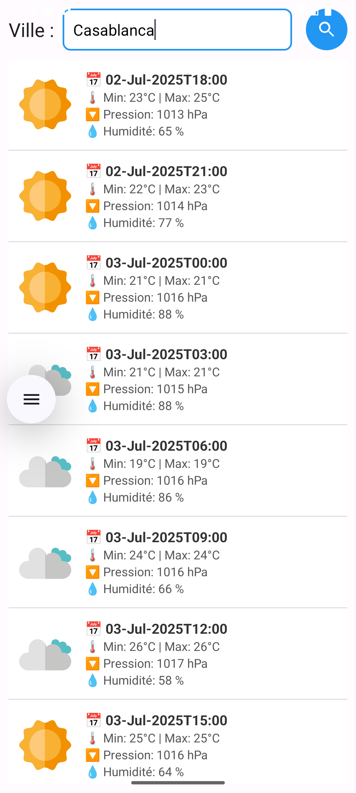
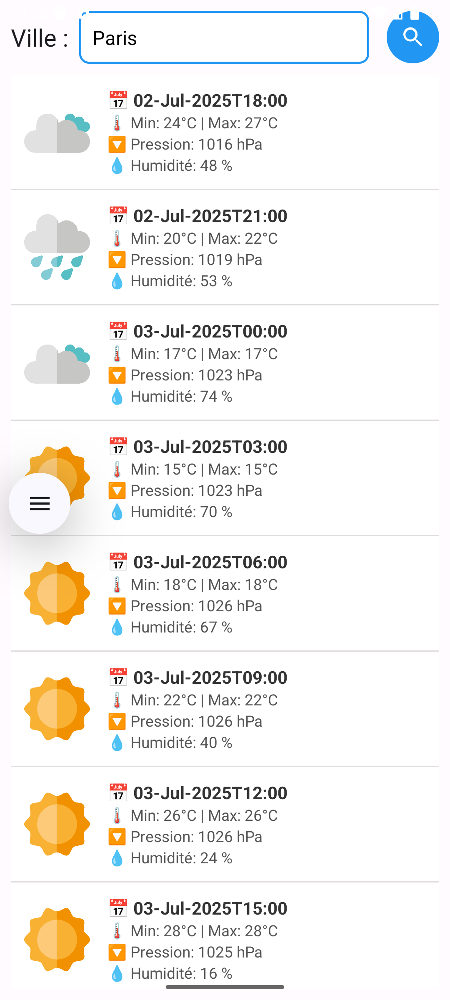

# 🌤️ WeatherApp - Application Météo Android

Une application Android simple qui permet d'afficher les prévisions météo d'une ville saisie par l'utilisateur.  
Elle utilise l'API REST de [OpenWeatherMap](https://openweathermap.org/api) et la bibliothèque **Volley** pour effectuer les requêtes HTTP.

## 📱 Fonctionnalités

- Saisie du nom d'une ville
- Appel à l'API OpenWeatherMap pour récupérer les données météo
- Affichage des prévisions sous forme de liste :
    - 📅 Date et heure
    - 🌡️ Température maximale et minimale
    - 🌬️ Pression atmosphérique
    - 💧 Humidité
    - 🌤️ Icône météo (Clear, Clouds, Rain...)

## 🛠️ Tech Stack

- **Langage :** Java
- **IDE :** Android Studio
- **API :** OpenWeatherMap (exemple ou clé personnelle)
- **Réseau :** Volley
- **Design :** ListView avec un `ArrayAdapter` personnalisé
- **UI :** XML Layouts + Drawable Shapes

## 📷 Capture d’écran




## 🔧 Installation

1. Clone le projet ou télécharge le ZIP
2. Ouvre le dossier dans Android Studio
3. Dans le fichier `MainActivity.java`, remplace la clé API dans l’URL :
   ```java
   String url = "https://api.openweathermap.org/data/2.5/forecast?q=" + ville + "&appid=YOUR_API_KEY";
4. Exécute l'application sur un émulateur ou un appareil physique.

## 🔑 Obtenir une clé API OpenWeatherMap
1. Va sur https://openweathermap.org/api
2. Crée un compte (gratuit)
3. Récupère ta clé API dans ton tableau de bord
4. Remplace YOUR_API_KEY dans le code source par ta clé

## 📞 Contact
- Développeur : Leknouch Wissal
- Email : wissalleknouch@gmail.com
- GitHub : @Clear008

